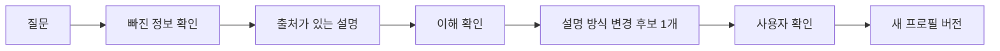

# 카투사

[](https://github.com/ljhljh0703-cmd/katousa-agent-harness/actions/workflows/ci.yml)

> **수익률은 못 올려도, 이해도는 올려드립니다.**
>
> 설명은 나에게 맞게. 안전 기준은 누구에게나 같게.

카투사는 초보 투자자가 스스로 판단 기준을 세우도록 돕는 AI 투자 이해 파트너입니다. 종목을 골라 주거나 주문을 대신하지 않습니다. 지금 빠진 정보가 무엇인지, 어떤 위험을 놓쳤는지, 무엇이 확인되면 판단이 달라지는지를 설명합니다.

대화를 거듭하면 설명은 숫자형·사례형·체크리스트형 중 나에게 편한 방식으로 바뀝니다. 그러나 출처 확인, 위험 고지, 비권유, 비실행 원칙은 바뀌지 않습니다.

[작동 구조](docs/IMPLEMENTATION-SPEC.md) · [상세 케이스 스터디](docs/PORTFOLIO-CASE-STUDY.md) · [검증 근거](docs/EVIDENCE-MAP.md) · [사용자 테스트 계획](docs/USER-RESEARCH-PLAN.md)

## “지금 사도 돼요?”에 바로 답하지 않습니다

```text
사용자  지금 가격이 급등 중이라는데, 바로 사야 할까요?

카투사  현재 가격의 출처와 확인 시각이 없어요.
        지금은 매수 결론보다 근거를 먼저 확인해야 해요.
```

카투사의 목표는 더 그럴듯한 결론을 만드는 것이 아닙니다. 사용자가 **확인된 사실**, **아직 모르는 것**, **결정을 바꿀 조건**을 구분하도록 돕는 것입니다. 근거가 부족하면 설명을 꾸며 내지 않고 멈춥니다.

## 설명은 유연하게, 안전은 완고하게

| 대화하며 맞추는 것 | 사용자 확인 없이는 바꾸지 않는 것 |
|---|---|
| 설명 길이 | 투자 목표 |
| 숫자·사례·체크리스트 형식 | 투자 기간 |
| 초보자·중급자 어휘 | 손실 감수 범위 |
| 확인 질문의 밀도 | 유동성·중요 제약 |

한 번의 오해나 손익 결과로 사용자를 공격적인 투자자로 규정하지 않습니다. 바꿀 수 있는 항목도 한 번에 하나만 후보로 제안하고, 사용자가 확인한 뒤 새 버전으로 적용합니다.

## 카투사가 성장하는 순서



카투사는 대화를 곧바로 학습하지 않습니다. 관찰한 내용을 변경 후보로 남기고, 코드 검증과 사용자 확인을 통과한 경우에만 적용합니다. 같은 실패가 세 번 반복되면 새 규칙을 즉흥적으로 만들지 않고 중단합니다.

이 저장소에서 **하네스**는 AI가 해도 되는 일과 하면 안 되는 일을 코드로 나눈 안전장치를 뜻합니다. 질문 해석과 설명은 언어 모델이 맡고, 출처 검사·금지 표현·상태 변경·반복 중단은 결정론 코드가 맡습니다.

## 다섯 가지 상황에서는 멈춥니다

- 현재 정보에 출처나 확인 시각이 없을 때
- 핵심 출처끼리 내용이 충돌할 때
- 수익 보장이나 긴급 매수를 압박하는 표현이 들어올 때
- 투자 목표·기간·손실 감수 범위를 확인 없이 바꾸려 할 때
- 손익 결과를 근거로 사용자 성향을 바꾸려 할 때

멈춤은 오류가 아닙니다. 지금 판단하기에 무엇이 부족한지 알려 주는 결과입니다.

## 구현에서 직접 통제한 것

### 설명 생성과 안전 판정을 분리했습니다

언어 모델은 질문을 해석하고 설명을 만듭니다. 코드가 같은 출력의 출처·위험·금지 표현·상태 변경을 다시 검사합니다. 자연스러운 문장과 안전한 동작을 한 모델의 판단에 함께 맡기지 않았습니다.

### 기억을 덮어쓰지 않습니다

선호와 이해 결과는 사건 단위로 추가합니다. 변경 이유와 사용자 확인을 남기며, 삭제 요청이 들어오면 원문은 지우고 내용이 없는 삭제 영수증만 보존합니다.

### 실패가 재발하지 않게 만들었습니다

기억 삭제 뒤 사건 ID가 재사용되던 문제, 앞 단계가 끝나기 전에 검증이 실행되던 문제, 검사 명령이 금지 문자열로 오탐되던 문제를 실제 실행에서 발견했습니다. 각 문제를 좁은 규칙과 회귀 테스트로 고쳤습니다.

## 검증 결과

| 검증 | 결과 | 확인한 것 |
|---|---:|---|
| 단위 테스트 | 29개 통과 | 상태 변경, 삭제, 금지 표현, 패키징, 공개 증거 |
| 고정 사례 반복 실행 | 30회 | 10개 사례 × 3개 설명 형식 |
| 정상 처리 | 15회 | 설명과 안전 조건 동시 통과 |
| 의도된 차단·실패 | 15회 | 위험하거나 불완전한 입력 거부 |
| 안전 기준 불일치 | 0건 | 설명 형식이 달라도 같은 안전 판단 유지 |
| GitHub Actions | 통과 | Python 3.11·3.12에서 자동 재현 |

이 수치는 투자 성과가 아니라 **작동 과정과 안전 조건**을 검증한 결과입니다. 축약한 실행 증거는 [`portfolio-evidence.json`](docs/portfolio-evidence.json)에서 확인할 수 있습니다.

## 직접 실행하기

외부 패키지 없이 Python 표준 라이브러리로 실행합니다.

```bash
git clone https://github.com/ljhljh0703-cmd/katousa-agent-harness.git
cd katousa-agent-harness

python3 -m unittest discover -s tests -v
python3 scripts/run_replay_eval.py --out dist
python3 scripts/export_portfolio_evidence.py
```

플러그인 구성과 개별 명령은 [`plugins/calm-trade-growth-harness/README.md`](plugins/calm-trade-growth-harness/README.md), 정상·차단·성향 변경 데모는 [`DEMO-SCENARIO.md`](docs/DEMO-SCENARIO.md)에 정리했습니다.

## 아직 증명하지 않은 것

- 실제 사용자의 이해도가 좋아졌는지
- 설명 방식의 변화가 투자 결과에 영향을 주는지
- 실제 증권 계좌와 연결해도 안전한지
- 법률·컴플라이언스 기준을 충족하는지

현재는 고정 사례로 검증한 프로토타입입니다. 초보 사용자 5~8명을 대상으로 위험 재진술, 부족한 정보 식별, 설명 선호를 확인하는 테스트를 준비하고 있습니다.

## 프로젝트 배경

카투사는 카카오페이증권 문제를 대상으로 한 해커톤에서 시작했습니다. 이름은 “카카오 투자하는 사람”에서 따왔지만, 카카오페이증권의 공식 제품이나 연동 서비스는 아닙니다. 투자 자문·종목 추천·주문 실행·수익 보장을 제공하지 않습니다.

[MIT License](LICENSE)
