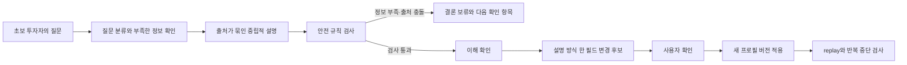

# 카투사 — 사용자를 기억하되, 안전 기준은 학습시키지 않는 투자 이해 파트너

> 수익률은 못 올려도, 이해도는 올려드립니다.
>
> 투자는 내가, 설명은 카투사가.

## 30초 요약

카투사는 초보 투자자의 질문과 이해 결과를 기억해 설명 형식을 조절하는 Codex 플러그인이다. 숫자형·사례형·체크리스트형처럼 **설명하는 방식은 사용자에게 맞춰 바꾸지만**, 출처·위험 고지·비권유·비실행 원칙은 바꾸지 않는다. 나는 언어 모델에 질문 해석과 설명 생성을 맡기고, 상태 변경과 안전 검증은 결정론 코드로 분리했다. 29개 단위 테스트와 10개 사례×3개 설명 성향의 replay 30회로 이 경계를 확인했다.

이 프로젝트는 투자 자문이나 자동매매 시스템이 아니다. 실제 사용자 이해도 향상과 투자 성과도 아직 측정하지 않았다.

## 왜 만들었나

초보 투자자는 “지금 사도 될까요?”처럼 결론부터 묻는다. 하지만 투자 목적, 기간, 손실 감수 범위, 현재 정보의 출처가 비어 있으면 좋은 문장만으로는 안전한 설명이 되지 않는다.

개인화도 별도의 위험을 만든다. 사용자가 숫자 설명을 선호한다는 사실은 기억해도 되지만, 한 번의 행동이나 손익을 보고 위험성향이 바뀌었다고 추정하면 안 된다. 그래서 문제를 “더 똑똑한 투자 답변”이 아니라 다음 두 질문으로 다시 정의했다.

1. 사용자가 이해하기 쉬운 방식으로 설명이 달라지는가?
2. 개인화가 진행돼도 안전 기준과 최종 결정권은 그대로 남는가?

## 내가 내린 핵심 결정

### 1. 생성과 통제를 분리했다

언어 모델은 질문을 분류하고, 사실·해석·미확인을 나누고, 이해 확인 질문을 만든다. 반면 출력 형식, 출처와 관찰 시각, 금지 표현, 프로필 변경 조건, 반복 중단은 코드가 검사한다. 자연어 모델 하나에 설명과 안전 판정을 모두 맡기지 않았다.

### 2. 적응 가능한 것과 바꿀 수 없는 것을 나눴다

바꿀 수 있는 것은 설명 길이·형식·어휘·질문 밀도다. 목표·투자 기간·손실 감수 범위·유동성·안전 규칙은 사용자 확인 없이는 바뀌지 않는다. 손익은 어느 쪽의 변경 근거로도 쓰지 않는다.

### 3. 한 번에 하나만 바꾸게 했다

대화에서 이해 실패가 확인돼도 프로필 전체를 다시 쓰지 않는다. 한 필드의 변경 후보만 만들고, 사용자가 확인한 뒤 새 버전으로 적용한다. 같은 실패가 세 번 반복되면 새로운 규칙을 즉흥적으로 만들지 않고 멈춘다.

## 카투사의 작동 방식

여기서 **헤르메스형 하네스**는 제품명이 아니라 설계 방식을 설명하는 포트폴리오 용어다. 관찰한 내용을 곧바로 학습시키지 않고, `관찰 → 변경 후보 → 검증 → 사용자 승인 → 버전 적용` 순서로만 성장시킨다는 뜻이다. 자동 자기개조나 온라인 학습을 구현했다는 주장이 아니다.

## AI 에이전트·하네스·루프의 역할

| 구분 | 카투사에서 맡은 일 | 핵심 파일 |
|---|---|---|
| AI 에이전트 | 질문 분류, 출처가 묶인 설명, 중립적 선택 경로, 이해 확인 질문 생성 | `SKILL.md` |
| 하네스 엔지니어링 | 출력 계약, 금지 표현, 출처·시각 검사, 확인 없는 변경 차단, audit·forget | `contracts.py`, `validate_output.py` |
| 루프 엔지니어링 | 사건 기록, 한 필드 후보, 사용자 확인, 버전 적용, replay, circuit breaker | `state.py`, `replay.py` |

## 구현 중 발견한 실패

### 삭제 뒤 이벤트 ID가 재사용됐다

forget 기능이 사건을 지우자 단순 행 개수로 다음 ID를 만들던 로직이 과거 ID를 다시 발급했다. ID 생성 기준을 “현재 행 수”에서 “기존 suffix의 최댓값+1”로 바꾸고, 삭제 순서가 달라도 중복되지 않는 회귀 테스트를 추가했다.

### 생성과 검증을 동시에 돌리자 검증이 먼저 끝났다

ZIP 생성과 검증은 의존 관계가 있는데 병렬 실행해 검증기가 아직 없는 파일을 읽었다. 두 작업을 순차 단계로 바꾸고, 생성 성공 뒤에만 검증이 실행되도록 고쳤다.

### 검사 명령 자체가 금지 문자열로 오탐됐다

로그 안의 검사 명령에 들어 있던 변조 표식이 실제 변조로 잡혔다. 탐지를 끄거나 로그를 지우지 않았다. 구조화된 JSONL에서 `item.command`만 좁게 예외 처리하고, 다른 필드에 같은 표식이 나타나면 계속 차단하게 했다.

이 세 실패는 “AI가 코드를 많이 만들었다”보다 이 프로젝트에서 내가 맡은 일을 더 잘 보여 준다. 나는 모델의 제안을 그대로 채택하지 않고, 실패가 다시 발생하지 않는 조건을 코드와 테스트로 남겼다.

## 검증 결과

| 확인 항목 | 결과 | 무엇을 증명하지 않는가 |
|---|---:|---|
| 단위 테스트 | 29개 통과 | 실제 사용자 만족도나 금융 적합성 |
| replay | 30회, 15 PASS / 15 expected FAIL | 투자 수익률 |
| 설명 성향 | checklist·example·numbers | 특정 형식이 더 잘 이해된다는 사용자 연구 |
| 안전 불변식 | 성향별 불일치 0건 | 모든 금융 상황의 안전성 |
| 플러그인·스킬 validator | 통과 | 카카오페이증권 공식 연동 |
| 개인정보 보호 패키지 | 로컬 경로·이메일 탐지 0건 | 원본 대화 제출 또는 외부 심사 승인 |

공개 검토용으로 축약한 replay 결과는 [`portfolio-evidence.json`](portfolio-evidence.json), 전체 주장과 근거는 [`EVIDENCE-MAP.md`](EVIDENCE-MAP.md)에 정리했다.

## 현수봇과 무엇이 다른가

두 프로젝트를 같은 “금융 AI”로 묶으면 차이가 흐려진다. 포트폴리오에서는 다음처럼 역할을 분리한다.

| | 현수봇 | 카투사 |
|---|---|---|
| 한 줄 정의 | 퀀트형 자동매매 에이전트를 통제하는 행동 하네스 | 초보 투자자에 맞춰 성장하는 설명 에이전트를 통제하는 헤르메스형 하네스 |
| 주된 위험 | 잘못된 판단이 주문과 손실로 이어짐 | 개인화가 편향·확신·무단 프로필 변경으로 이어짐 |
| 통제 대상 | 외부 행동 | 내부 적응 |
| 결정론적 장치 | RiskManager, kill switch, 한도, TP/SL, dry-run | 출처 검사, 비권유·비실행, one-change rule, 확인, audit·forget |
| 사람에게 남긴 권한 | 실거래 전환과 규칙 채택 | 투자 결정과 중요한 프로필 변경 |

두 사례를 관통하는 한 문장은 이것이다.

> 돈을 움직이는 AI는 행동을 통제해야 하고, 사람에 맞춰 변하는 AI는 적응을 통제해야 한다.

현수봇의 공개 근거는 [검증된 저장소 commit](https://github.com/ljhljh0703-cmd/binance-trading-bot/tree/5ae142ff5837cf23f26547536f32dbc5fdb0bd32)에 한정한다. “퀀텀”은 양자컴퓨팅 구현으로 오해될 수 있어 외부 문구에서는 사용하지 않는다.

## 한계와 다음 검증

- 실제 초보 투자자를 대상으로 이해도 전후 비교를 하지 않았다.
- 라이브 시세와 증권 계좌에 연결하지 않았다.
- 투자 자문·종목 추천·주문 실행을 제공하지 않는다.
- 카카오페이증권의 공식 제품·연동·보증이 아니다.
- 법률·컴플라이언스 적합성은 별도 전문가 검토가 필요하다.

다음 단계는 실제 사용자 5~8명을 대상으로 같은 개념을 세 설명 형식으로 제시하고, 위험 요소 재진술·판단 변경 조건 회상·설명 선호를 측정하는 소규모 이해도 테스트다. 이 검증 전에는 “이해도를 높였다”가 아니라 “이해도에 맞춰 설명을 바꾸는 구조를 구현했다”고 표현한다.

## 빠른 검토 경로

1. [`README.md`](../README.md)에서 문제와 검증 요약을 본다.
2. [`portfolio-evidence.json`](portfolio-evidence.json)에서 정상·차단·확인 필요 사례를 확인한다.
3. [`DEMO-SCENARIO.md`](DEMO-SCENARIO.md)로 동일 흐름을 재현한다.
4. [`EVIDENCE-MAP.md`](EVIDENCE-MAP.md)에서 주장 경계를 확인한다.
